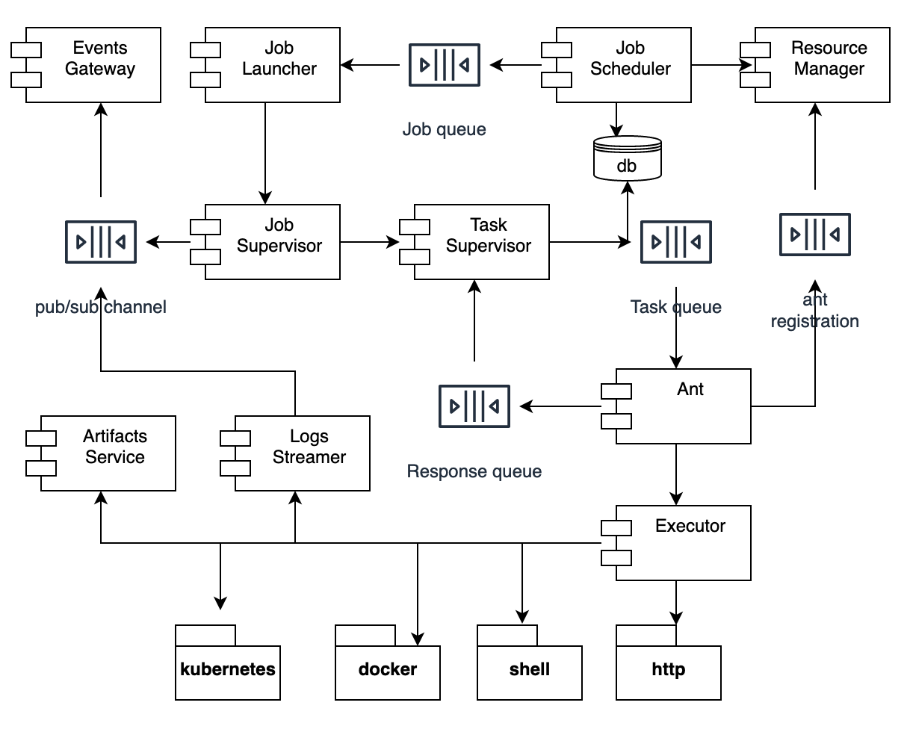
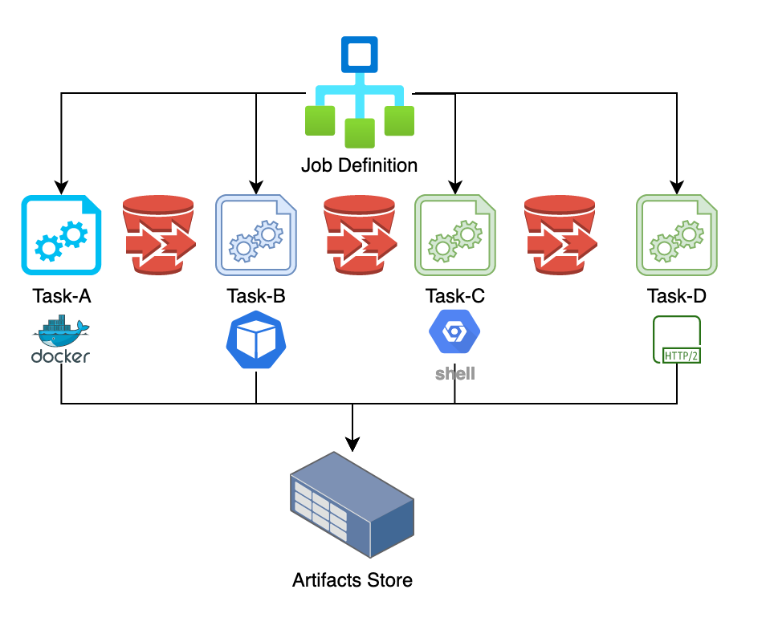

## High level Architecture

The formicary architecture is based on the *Leader-Follower* (or master/worker) pattern
where queen-leader schedules and orchestrates execution of the graph of tasks. The task defines a unit of work, which is distributed among ant-workers
based on the task tags and executor protocols such as Kubernetes, Docker, Shell, HTTP, etc. The queen-leader
encompasses resource-manager, job-scheduler, job-launcher and job/task supervisors, where job-scheduler finds next job to 
execute based on resource-manager and hands-off the job to job-launcher. The job-supervisor orchestrates the 
job execution and delegates task to the task-supervisor, which sends the request to a remote ant worker and then waits for the response.
After task completion, the task-supervisor persists the results and job-supervisor finds the next task to execute based on 
exit-values of previous task and persists its state. 

### Physical Architecture
Following is a high level physical architecture of the Formicary:

The major layers of physical architecture includes:
#### Dashboard
The Dashboard UI provides following functionality:
  - View current, pending or past jobs
  - Submit new jobs
  - View job definitions or upload new job definitions
  - Monitor ant workers and executors
  - View or upload artifacts
  - Manage configuration, error-codes and resources
  - View Real-time and historical Reports

#### Queen Server/API
The queen server schedules and orchestrates jobs for execution. It also provides API for following functionality:
  - Query current, pending or past jobs
  - Submit new jobs
  - Query or update job definitions
  - Register ant workers and manage available resouces for procssing
  - Query or upload artifacts
  - Manage configuration, error-codes and resources
  - Provide Real-time and historical Reports

#### Ant workers
The ant workers registers themselves with the queen server and receives work for tasks. They use messaging queues
for communication with the server and provide following functionality:
   - Register with the server and continuously update them with their workload
   - Download dependent artifacts before execution
   - Execute tasks using supported executors such as Docker, HTTP, Kubernetes, Shell, etc.
   - Upload artifacts at the end of task
   - Monitor Docker/Kubernetes containers and notify server with their lifecycle events

#### Database
The formicary uses relational database to persist job requests, definitions, resources, error-codes, configuration and other data.

#### Object-store
The formicary uses object-store to persist artifacts generated by the tasks, created by image cache or uploaded by the users.

### Component Architecture
Following diagram shows internals of queen server and ant workers:

The major components of the architecture includes:

#### Resource Manager
The resource manager registers the ant workers and keeps track of available resources for jobs processing. The ant
workers continuously update resource manager with their capacity and load so that resource manager can determine 
how many jobs can be concurrently running without exceeding workers' capacity.

#### Job Scheduler
The job scheduler queries pending jobs that are waiting for execution and uses resource manager to check if a job
can be scheduled for execution. If available resources are available, it sends a remote message to Job-Launcher 
for execution. 

Note: The formicary supports multiple instances of the servers where the scheduler runs on the leader node
but other servers run job-launcher/executor for job execution and orchestration.

#### Job Launcher
The job launcher listens for incoming request for job execution and launches execution of a job 
using Job-Supervisor, which monitors the job execution.

#### Job Supervisor
The job supervisor starts a job asynchronously and orchestrates execution of the job. It executes each task 
using Task-Supervisor and then chooses next task based on the status/exit-code of completed task.

#### Task Supervisor
The task supervisor executes a task by sending a remote message to the ant worker that supports the task-method 
and then waits for the reply message. The task-supervisor receives the result and saves the results in the database.

### Ant workers
An ant worker registers with the queen-server for methods/tags that it supports and then listens for incoming 
requests. It then executes each request asynchronously using executor methods defined by the task and sends back
the results. The ant worker downloads dependent artifacts before task execution and upload the artifacts at the
end of task. It also manages external containers such as Docker and Kubernetes and manages 
their lifecycle. The ant worker updates the queen servers with their capacity and load so that server does not
send excessive work. Note: You can spawn any number of ant workers that can load balance the work to be performed.

### Executor
An executor abstracts the runtime environment for execution a task. The formicary uses method to define the type 
of executor. Following executor methods are supported:

|     Executor |   Method |
| :----------: | :-----------: |
| Kubernetes Pods | KUBERNETES |
| Docker containers | DOCKER |
| Shell | SHELL |
| HTTP (GET POST, PUT, DELETE) | HTTP_GET HTTP_POST_FORM HTTP_POST_JSON HTTP_PUT_FORM HTTP_PUT_JSON HTTP_DELETE |
| Fork/Await | JOB_FORK, JOB_FORK_AWAIT |
| Artifact/Expiration | EXPIRE_ARTIFACTS |
| Messaging | MESSAGING |

#### Processing Pipeline (Pipes & Filters)
The formicary applies pipes & filters pattern where tasks takes parameters or artifacts as input and produce other sets of artifacts and response variables, which in turn 
can be used by other tasks as input in the data pipeline processing, e.g.

Following are fundamental concepts in formicary:
#### Job Definition
A job represents a directed acyclic graph (DAG) of tasks that are executed where each subsequent task is 
determined by completion status of prior task. The job definition defines dependency of tasks for executing 
the workflow. The formicary uses YAML configuration to define job and task definitions.

#### Task Definition
A task represents a unit of work that is executed by an executor. The job definition defines tasks and the
relationship between the tasks in YAML configuration.

See [Definition Options](definition_options.md) for more details on job and task configuration.

#### Job Request
Once a job is defined, a user can submit a request to schedule a job, which is stored in the database as `PENDING`
state. The job scheduler then launches the job based on available resources  and changes job's state to `READY`.
Note: A user can submit a job with schedule date in `future` so that it's not immediately executed. A job definition may 
also define a cron property that automatically creates job requests at scheduled time for job execution.

#### Job Execution
A job-execution represents an instance of job when a job is started by the job-launcher. The job-launcher saves this
instance in the database as well and then hands-off the job to job-supervisor for execution and changes the 
state of job request and execution to `EXECUTING`. The job supervisor orchestrates the job execution and 
changes the state of job request and execution to `COMPLETED` or `FAILED` state at the end of execution. 
The formicary fires Job lifecycle events to update these changes of state that can be listened by UI or API clients.

#### Task Execution
A task-execution represents an instance of task when a task is started by the task supervisor. The task supervisor
saves task instance in the database and builds a task request that is sent to remote ant worker. The task supervisor
waits for the response and then updates the database. The task execution ends with `COMPLETED` or `FAILED` state but 
it also supports `exit-code` that can be passed by the worker. The orchestration rules can choose the next task to
run based on ending `state` or `exit-code`.
