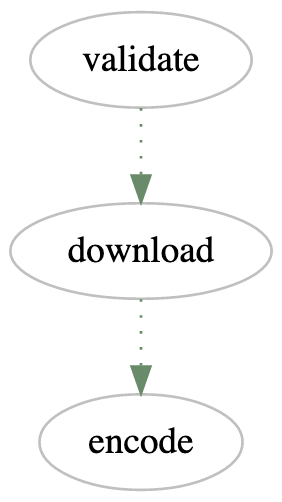

## Pipelines
A pipeline abstracts stages of data processing that can be used for various use cases such as CI/CD pipeline
for software development, ETL for importing/exporting data or other form of batch processing. The formicary provides
support of pipelines via tasks and jobs where task defines a unit of work and job defines directed acyclic
graph of tasks. The tasks within a job are executed serially, and the order of tasks is determined by the exit 
status of prior task. 

### Simple Pipeline Job
Following example shows a simple pipeline example:



#### Job Configuration
Following example defines job-definition with a simple pipeline:
```yaml
job_type: video-encoding
description: Simple example of video encoding
max_concurrency: 1
tasks:
- task_type: validate
  script:
    - echo request must have URL {{.URL}}, InputEncoding {{.InputEncoding}} and OutputEncoding {{.OutputEncoding}}
  container:
    image: alpine
  on_completed: download
- task_type: download
  container:
    image: python:3.8-buster
  script:
    - curl -o video_file.{{.InputEncoding}} {{.URL}}
  artifacts:
    paths:
      - video_file.{{.InputEncoding}}
  on_completed: encode
- task_type: encode
  container:
    image: alpine
  script:
    - ls -l
    - mv video_file.{{.InputEncoding}} video_file.{{.OutputEncoding}}
  dependencies:
    - download
  artifacts:
    paths:
      - video_file.{{.OutputEncoding}}
```

#### Job Type
The `job_type` defines `video-encoding` for the job type.
```yaml
job_type: video-encoding
```

#### Description
THe `description` defines description of the job, e.g.
```yaml
description: Simple example of video encoding
```

#### Concurrency
You can optionally add `max_concurrency` to limit maximum instances of the job, e.g.
```yaml
max_concurrency: 1
```

#### Tasks
The tasks define the DAG that are executed for `video-encoding` job.

##### Task Type
The `task_type` defines name of the task, e.g.
```yaml
- task_type: validate
```

##### Task method
The `method` defines executor type such as KUBENETES, DOCKER, SHELL, etc:
```yaml
  method: KUBERNETES
```

##### Docker Image
The `image` tag within `container` defines docker-image to use for execution commands, e.g.
```yaml
  container:
    image: alpine
```

##### Script Commands
The `script` defines an array of commands that are executed inside container, e.g.
```yaml
  script:
    - curl -o video_file.{{.InputEncoding}} {{.URL}}
```
Above example will execute `curl` command to download a file and store it locally.

##### Artifacts
The output of commands can be stored in an artifact-store so that you can easily download it, e.g.
```yaml
  artifacts:
    paths:
      - video_file.{{.InputEncoding}}
```
In above definition, video file will be uploaded to the artifact-store.

The artifacts from one task can be used by other tasks, e.g. `encode` task is listing `download` under
`dependencies` so it will be automatically made available for the `encode` task.
```yaml
- task_type: encode
  dependencies:
    - download
```

##### Next Task
The next task can be defined using `on_completed`, `on_failed` or `on_exit`, e.g.
```yaml
on_completed: download
```
Above task defines `download` task as the next task to execute when it completes successfully. 
The last task won't use this property, so the job will end.

##### Job Parameters
You can pass job parameters when submitting a job that can be used by the job configuration such as
`URL`, `InputEncoding`, and `OutputEncoding`.
```yaml
    - echo request must have URL {{.URL}}, InputEncoding {{.InputEncoding}} and OutputEncoding {{.OutputEncoding}}
```

### Uploading Job Definition
You can store the job configuration in a `YAML` file and then upload using dashboard UI or API such as:

```yaml
curl -v -H "Authorization: Bearer $TOKEN" \
  -H "Content-Type: application/yaml" \
    --data-binary @video-encoding.yaml $SERVER/api/jobs/definitions
```
You will need to create an API token to access the API using [Authentication](apidocs.md#Authentication) to
the API sever defined by $SERVER environment variable passing token via $TOKEN environment variable.

### Submitting Job Request Manually
You can then submit the job as follows:

```yaml
curl -v -H "Authorization: Bearer $TOKEN" \
    -H "Content-Type: application/json" \
    --data '{"job_type": "video-encoding", "params": {"InputEncoding": "MP4", "OutputEncoding": "WebM", "URL": "https://github.com"}}' $SERVER/api/jobs/requests
```
The above example kicks off `video-encoding` job and passes `URL`, `InputEncoding`, and `OutputEncoding` as parameters.

